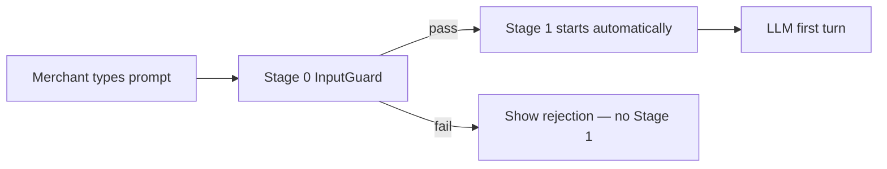
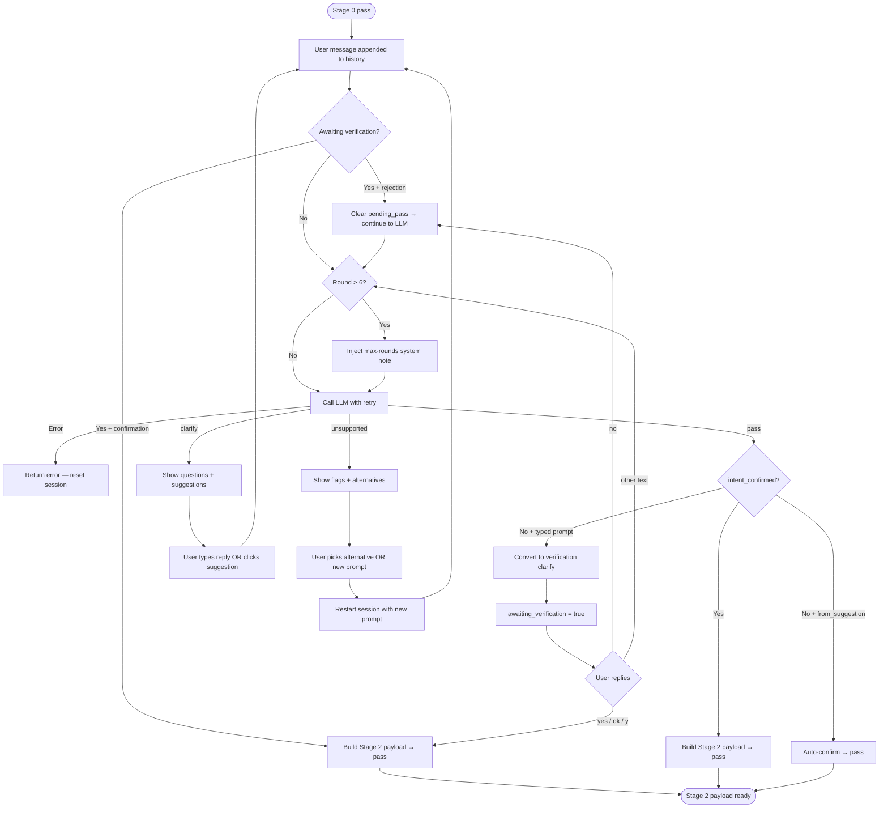
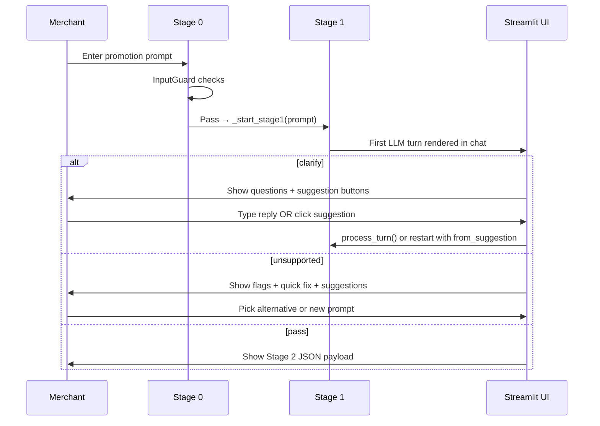

# Stage 1 — Promotion Classifier Workflow

Stage 1 is the LLM conversation layer in the Kite promotion pipeline. It classifies merchant promotion requests, asks focused clarification questions when needed, verifies intent, and outputs validated JSON for Stage 2.

```
Stage 0 (InputGuard)  →  Stage 1 (Classifier)  →  Stage 2 (Store grounding / IR)
     regex + embed              LLM loop                 (planned)
```

**Entry point:** `streamlit run main.py` or `python stage1.py` (CLI)

**Key files:** `stage1.py`, `main.py`, `config.py`

---

## Role

Stage 1 does **not** build promotions or extract IR fields. It only:

1. Decides whether a request is **supported**, **unsupported**, or **needs clarification**
2. Determines the promotion **family** (`free_gift`, `buy_x_get_y`, `tiered_discount`)
3. Accumulates understanding across a multi-turn conversation
4. Verifies merchant intent before forwarding
5. Produces a validated **Stage 2 payload** on success

---

## Pipeline entry (Stage 0 → Stage 1)



**Stage 0 checks (in order):**

| Check | What it does |
|-------|--------------|
| Length | Min 5 / max 1000 characters |
| Injection | Compiled regex patterns |
| Scope | Ollama embedding (`nomic-embed-text`) vs promotion corpus; threshold **0.60** |

When Stage 0 passes, `main.py` calls `_start_stage1(stage0_prompt)` with the **exact** merchant text unchanged.

---

## LLM configuration

| Setting | Value |
|---------|-------|
| Model | `gpt-oss:120b` (Ollama Cloud) |
| Output | Strict JSON only — validated + one retry on schema errors |
| Max clarification rounds | **6** (`MAX_CLARIFICATION_ROUNDS`) |
| Suggested promotions per response | **5–6** items |

---

## Three verdicts

Every LLM turn returns exactly one of:

| Verdict | Meaning | Session status |
|---------|---------|----------------|
| `clarify` | Missing or ambiguous info — ask up to 2 questions | `active` |
| `unsupported` | Intent is clear but uses unsupported mechanisms | `rejected` |
| `pass` | Complete, supported, confirmed promotion | `passed` |

---

## Decision pipeline (LLM — every turn)

The system prompt enforces this order:

```
STEP 1  Scan for unsupported flags → if any → unsupported (stop)
STEP 2  Is this a supported promotion? → if unclear → clarify
STEP 3  Determine family → if not 100% certain → clarify (never guess)
STEP 4  Are all fields explicit? → if any ambiguity → clarify
STEP 5  Only then consider pass
STEP 6  Intent verification → merchant must confirm before pass
```

**No assumptions rule:** Never guess currency, units, denomination, reward type, or family. If anything could be read two ways → `clarify`.

**Round 6 rule:** After 6 rounds, the LLM must return `pass` or `unsupported` — no more `clarify`. If still ambiguous → `unsupported`, not pass with guesses.

---

## Supported promotion families

| Family | Label | Structure |
|--------|-------|-----------|
| `free_gift` | 🎁 Free Gift | One threshold → one **free physical product** |
| `buy_x_get_y` | 🛒 Buy X Get Y | One threshold → one discount or free item |
| `tiered_discount` | 📊 Tiered Discount | **2+ tiers** on the same dimension (spend/quantity ladder) |

### Family disambiguation (most common confusion)

```
1 threshold + 1 reward     →  buy_x_get_y  (or free_gift if reward is a free product)
2+ thresholds + rewards    →  tiered_discount  (same trigger type/scope across tiers)
```

**Examples:**

- `"Spend $100 and get a free gift"` → `free_gift`
- `"Spend $100 and get 10% off"` → `buy_x_get_y`
- `"Spend $100 get 10%, spend $200 get 20%"` → `tiered_discount`
- `"Buy a $50 gift card get $10 free, buy $100 get $25 free"` → `tiered_discount` (multi-tier gift card ladder)

---

## Unsupported flags

These are scanned **independently** in Step 1. A valid core promotion + one flag = still `unsupported`.

| Flag | Triggers on |
|------|-------------|
| `discount_code` | Coupon, promo code, voucher required to activate |
| `free_shipping` | Waiving delivery/shipping/postage fees |
| `usage_limit` | Total redemption caps, one-use-per-customer limits |
| `pos_only` | Physical store / POS-only restrictions |
| `scheduling` | Expiry, flash sale, start/end dates, time windows |

**Not flags:** VIP/customer tags, logged-in restrictions, "first purchase", "limited edition" products.

Unsupported responses include per-flag reasons, alternatives, a `supported_alternative` string, and 5–6 `suggested_promotions`.

---

## Full conversation flow



---

## Code-enforced verification

The LLM is instructed to verify before pass (Step 6), but **Python also enforces** this in `process_turn()`:

1. LLM returns `verdict: "pass"`
2. If `intent_confirmed` is false and **not** `from_suggestion`:
   - `make_verification_clarify()` converts the pass into a `clarify` response
   - Shows: understood intent, family, proposed prompt, confirm question
   - Sets `awaiting_verification = true`, stores `pending_pass`
3. User must confirm before the real pass is emitted

### Accepted confirmation replies

Short affirmatives are accepted — no need for exact phrasing:

- `yes`, `yes.`, `y`, `ok`, `okay`, `sure`, `correct`, `1`
- Also: `that's correct`, `that's right`, `go ahead`, etc.

Rejection starters: `no`, `nope`, `not quite`, `wrong`, `wait`, `hold on` → clears pending pass and continues the conversation.

Verification question options shown in UI:

- **Yes**
- **No — I'll clarify further**

---

## Suggestion click flow (skip verification)

When the merchant **clicks a suggested promotion** (or "Use closest supported version"), verification is skipped — clicking is treated as explicit intent selection.

```
Click "Use suggestion N"
  → stage1_pick_prompt = prompt
  → stage1_pick_from_suggestion = true
  → _restart_stage1_with_prompt(prompt, from_suggestion=True)
  → Fresh session, from_suggestion=True
  → LLM classifies the canned prompt
  → If pass: auto-confirm (no verification step) → Stage 2 payload
```

**Manual "Start new promotion"** (typed text) sets `from_suggestion=False` — normal verification applies.

---

## Clarify response structure

Every `clarify` turn includes:

| Field | Purpose |
|-------|---------|
| `understood_so_far` | Plain sentence summarizing current understanding |
| `inferred_family` | Best family guess |
| `proposed_prompt` | Clean synthesis so far |
| `questions` | 1–2 focused questions (max 2 per turn) |
| `suggested_promotions` | 5–6 complete example prompts with family labels |

The Streamlit UI renders suggestions as clickable buttons with family label + `st.code` prompt.

---

## Unsupported recovery paths

When verdict is `unsupported` (`status: rejected`):

1. **Quick fix** — "Use closest supported version" button → restarts with `from_suggestion=True` (skips verification)
2. **Suggestion buttons** — same as clarify flow
3. **Start new promotion** — merchant types a new prompt → `from_suggestion=False` (verification required)

---

## Session state

`Stage1Session` tracks the full conversation:

| Field | Purpose |
|-------|---------|
| `stage0_prompt` | Original Stage 0 input |
| `history` | Full LLM message history |
| `user_turns` | All user messages |
| `clarification_rounds` | Incremented each user turn |
| `status` | `active` \| `passed` \| `rejected` |
| `awaiting_verification` | Waiting for yes/no on pending pass |
| `pending_pass` | Stored LLM pass result awaiting confirmation |
| `intent_confirmed` | Merchant confirmed intent |
| `from_suggestion` | Started from suggestion click — skip verification |
| `confirmed_prompt` | Final confirmed prompt text |
| `stage2_payload` | Validated JSON for Stage 2 |
| `pending_alternative` | Closest supported version from unsupported |
| `last_result` | Last LLM/clarify result (for UI suggestions) |

Serialized via `session_to_dict()` / `session_from_dict()` for Streamlit session state.

---

## Stage 2 output payload

On `pass`, Stage 1 builds and validates:

```json
{
  "prompt": "Spend $100 and get a free gift",
  "family": "free_gift",
  "family_label": "🎁 Free Gift"
}
```

| Key | Rule |
|-----|------|
| `prompt` | Exact confirmed user text (not LLM paraphrase unless confirmed) |
| `family` | One of `free_gift`, `buy_x_get_y`, `tiered_discount` |
| `family_label` | Derived from `FAMILY_LABELS` in `config.py` |

Validated by `validate_stage2_payload()` — only these three keys allowed.

---

## Streamlit UI flow (`main.py`)



**UI metrics shown:** Status, rounds (N / 6), last verdict, Stage 0 input.

**Chat input:** Available when `status == active` and last verdict is `clarify`, `error`, or unset. Not shown after `pass` or while waiting on a terminal `unsupported` without active clarify.

**Deferred pick pattern:** Suggestion buttons set `stage1_pick_prompt` in session state and call `st.rerun()` — the pick is processed on the next render to avoid Streamlit button state issues.

---

## Example end-to-end paths

### Path A — Typed prompt with clarification + verification

```
Turn 1  "Give VIP customers a discount"
        → clarify: what kind? what threshold?

Turn 2  "tiered, spend more save more"
        → clarify: what are the tiers?

Turn 3  "spend $100 get 10%, spend $200 get 20%"
        → verification clarify: "Is this what you want to set up?"

Turn 4  "yes"
        → pass → Stage 2 payload
```

### Path B — Complete prompt, verification only

```
Turn 1  "Spend $100 and get a free gift"
        → verification clarify (LLM would pass, code intercepts)

Turn 2  "ok"
        → pass → Stage 2 payload
```

### Path C — Suggestion click (no verification)

```
Turn 1  "discount for VIP" → clarify with suggestions

User clicks "Use suggestion 3" → "VIP customers spend $150 and get a free gift"
        → fresh session, from_suggestion=True
        → LLM pass → auto-confirm → Stage 2 payload (no yes/no step)
```

### Path D — Unsupported flag

```
Turn 1  "Spend $100 get 10% off with code SAVE10"
        → unsupported (discount_code flag)
        → shows alternative + 5–6 suggestions

User clicks "Use closest supported version"
        → restart from_suggestion=True → classify → pass
```

### Path E — Round 6 forced decision

```
Turns 1–5  ongoing clarify
Turn 6     system note injected: must pass or unsupported, no more clarify
           → if still ambiguous → unsupported with explanation
           → if fully clear + confirmed → pass
```

---

## CLI usage

```bash
python stage1.py                          # interactive
python stage1.py "Spend $100 get a gift"  # start with a prompt
echo "Spend $100 get a gift" | python stage1.py
```

On success, CLI prints:

```
FORWARDED: <exact promotion prompt>
```

Stage 2 reads this line as input (CLI mode). The Streamlit app uses the JSON payload instead.

---

## Error handling

| Situation | Behavior |
|-----------|----------|
| Empty user message | `error` verdict, no LLM call |
| Invalid LLM JSON | One automatic retry with schema error note |
| Second JSON failure | `error` verdict, session history reset |
| Connection error | `error` verdict, session history reset |

---

## What Stage 1 does NOT do

- Build IR / promotion skeleton
- Ground against store catalog (Stage 2)
- Modify the Stage 0 prompt on entry
- Support discount codes, free shipping, usage limits, POS-only, or scheduling
- Pass with assumed values on ambiguous input

---

## Quick reference

| Concept | Value |
|---------|-------|
| Verdicts | `clarify`, `unsupported`, `pass` |
| Families | `free_gift`, `buy_x_get_y`, `tiered_discount` |
| Max rounds | 6 |
| Questions per turn | 1–2 |
| Suggestions per response | 5–6 |
| Verification skip | Suggestion click, closest-supported click |
| Confirmation | `yes`, `ok`, `y`, etc. |
| Stage 2 keys | `prompt`, `family`, `family_label` |
