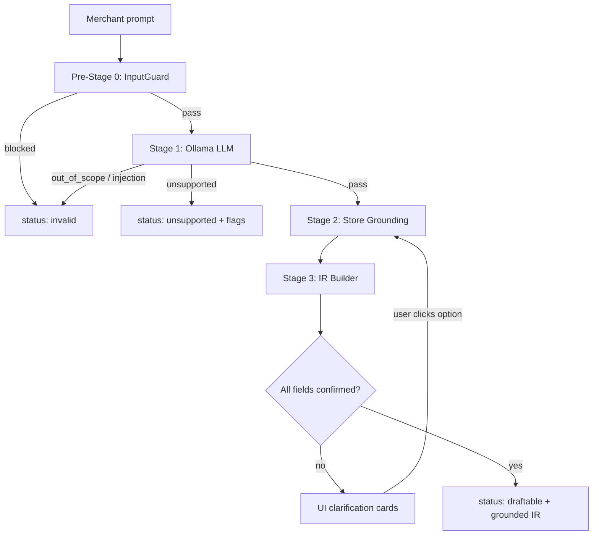

# Kite AI — Promotion Pipeline Workflow

Merchant describes a promotion in natural language. The pipeline validates it, classifies it, grounds it against the store catalog, and builds a typed IR skeleton the admin can publish.

**Run:** `streamlit run app.py`

---

## High-level flow



---

## Files

| File | Role |
|------|------|
| `app.py` | Main entry — InputGuard, Stage 1 LLM, FuzzyMapper, IR Builder, Streamlit UI |
| `store_grounding.py` | Stage 2 — catalog fuzzy match + clarification question generation |
| `store_catalog.json` | Store data — products, collections, customer tags, currencies, `clarification_schema` |
| `requirements.txt` | Python dependencies |
| `test_questions.txt` | Manual test prompts (reference) |
| `capability_scanner.py` | Legacy (not used by current pipeline) |
| `input_guard.py` | Legacy (superseded by `app.py`) |

---

## Pre-Stage 0 — InputGuard

**Purpose:** Block bad input before any LLM call (~10–50 ms, zero API cost).

| Check | Method | On fail |
|-------|--------|---------|
| Injection | Compiled regex patterns | `verdict: injection` |
| Scope | `all-MiniLM-L6-v2` embeddings vs promotion corpus | `verdict: out_of_scope` |
| Length | Min/max character limits | `verdict: out_of_scope` |

If InputGuard intercepts, Ollama is **not** called.

---

## Stage 1 — Ollama LLM (`gpt-oss:120b`)

**Purpose:** Decide if the prompt is a supported promotion and extract **loose hints** (not final IR).

### Verdicts

| Verdict | Meaning | Next step |
|---------|---------|-----------|
| `pass` | Supported promotion family, no unsupported flags | → Stage 2 |
| `unsupported` | Supported scope but uses unsupported features | Stop — show flag messages |
| `out_of_scope` | Not a promotion request | Stop |
| `injection` | Prompt injection attempt | Stop |

### Supported promotion families (pass only)

| Family | Example |
|--------|---------|
| `free_gift` | Spend $100, get a free sample |
| `buy_x_get_y` | Buy 2 shirts, get 1 cap free |
| `tiered_discount` | Spend $150 → 15% off, spend $300 → 25% off |

### Unsupported flags (verdict = unsupported)

`discount_code` · `free_shipping` · `usage_limit` · `pos_only` · `scheduling`

Stage 1 may return **multiple flags** for one prompt. Evaluation treats a test as pass if **≥1** expected flag is matched.

### Stage 1 output on pass

Loose hints only — e.g.:

- `promotion_family_hint`
- `trigger_type_hint`, `trigger_value_hint`, `trigger_scope_hint`
- `reward_type_hint`, `reward_value_hint`, `reward_target_hint`
- `customer_eligibility_hints`, `tier_hints`, `tier_behavior_hint`

These hints are **not** written directly into the final IR.

---

## Stage 2 — Store Grounding

**Purpose:** Fill **gaps** in the IR — auto-apply what the merchant already said; ask only for missing or ambiguous store-backed fields.

Implemented in `store_grounding.py` using `store_catalog.json`.

### Core rule: ask only what's missing

| Already in prompt / Stage 1 hints | Stage 2 behaviour |
|-----------------------------------|-------------------|
| Currency (`rs`, `rupees`, `$`, `€`) | Auto-applied — **no question** |
| Trigger threshold (`100`, `buy 2`) | Auto-applied from hint |
| Discount amount (`10% off`, `10 rupees off`) | Auto-applied from hint |
| Exact product match (`Cap`, one clear hit) | Auto-resolved to catalog ID |
| Broad term (`shirts`, `apparel`, `skincare`) | **Multi-select** — pick product(s) or whole collection |
| Ambiguous product (`shirt` → 3 matches) | **Multi-select** cards |
| Customer tag mentioned clearly (`VIP`) | Auto-resolved if single match |
| Tag/market mentioned but vague | Ask — pills or multi-select |
| Market/country needed but not named | Ask from `market_catalog` |
| Value not mentioned at all | Ask with suggested pills |

Example — *10 rupees off on shirts if cart value is more than 100 rs*:

- **Auto-applied:** INR, trigger ₹100, reward ₹10
- **Asked once:** which shirt(s) or Apparel collection get the discount (multi-select)

### Optional Stage 2 LLM

When enabled (sidebar toggle, on by default), a second Ollama call may suggest catalog IDs for ambiguous fields. User confirmation is still required for multi-select / missing fields. Skipped on clarification re-runs.

### FuzzyMapper (inside Stage 2 path)

Before grounding, canonical enum values are resolved from hints:

- Promotion family, trigger type, reward type, scope type, tier behavior, eligibility type
- Uses `rapidfuzz` token-set ratio against synonym maps in `app.py`

### Clarification schema

`store_catalog.json → clarification_schema` defines question templates for:

| Scenario | Field |
|----------|-------|
| Missing / vague gift product | `reward.gift_product` |
| Ambiguous trigger product | `trigger.scope.productRef` |
| Ambiguous trigger collection | `trigger.scope.collectionRef` |
| Missing / unconfirmed threshold | `trigger.value` |
| Ambiguous Y target (buy X get Y) | `reward.y_target` |
| Missing customer tag | `customer_eligibility.*.value` |
| Missing market / country | `customer_eligibility.*.market` |
| Missing reward value | `reward.value` |
| Tiered discount with &lt; 2 tiers | `tier.1` |

### Catalog structure

```
store_catalog.json
├── product_taxonomy      # categories → products + aliases
├── collection_product_index
├── customer_tag_catalog
├── market_catalog          # IN, US, GB, …
├── currency_options      # INR, USD, EUR, …
└── clarification_schema
```

---

## Stage 3 — IR Builder

**Purpose:** Assemble the typed IR skeleton from fuzzy-mapped enums + **user-confirmed** catalog IDs.

Runs in `app.py` (`build_ir_skeleton` → `apply_grounding_to_ir`).

### Pipeline result statuses

| `pipeline_json.status` | Meaning |
|------------------------|---------|
| `invalid` | InputGuard or injection / out_of_scope |
| `unsupported` | Unsupported flags present |
| `needs_clarification` | Pass from Stage 1, but user must confirm Stage 2 fields |
| `draftable` | All required fields confirmed — IR ready |

### `pipeline_json` shape

```json
{
  "status": "needs_clarification",
  "feature": "buy_x_get_y",
  "ir": { "feature": "...", "trigger": {}, "reward": {}, "customer_eligibility": [] },
  "clarification_questions": [
    {
      "id": "ambiguous_y_target",
      "field": "reward.y_target",
      "question": "Which product or collection should receive the discount?",
      "ui_type": "multi_select",
      "options": [
        { "id": "c5", "label": "All Apparel", "subtitle": "collection" },
        { "id": "p11", "label": "Shirt", "subtitle": "Apparel", "recommended": true }
      ],
      "required": true
    }
  ],
  "grounding_resolved": {
    "currency": "INR",
    "trigger.value": 100,
    "reward.value": 10
  },
  "blockers": [],
  "warnings": [],
  "assumptions": [],
  "admin_selections_needed": []
}
```

After each UI selection, grounding re-runs with `user_selections` until `clarification_questions` is empty and `status` becomes `draftable`.

---

## Streamlit UI flow

1. Merchant enters prompt → **Send to pipeline**
2. InputGuard → Stage 1 LLM
3. On **pass**: show metrics + **Complete your promotion** (only if gaps remain)
4. Single-select: tap a card/pill · Multi-select: pick items + **Apply selection**
5. Pipeline re-grounds; answered questions disappear
6. When all confirmed → **grounded IR ready** + full `pipeline_json`

Sidebar:

- Model selector (`gpt-oss:120b`)
- **Stage 2 LLM grounding** toggle
- InputGuard test suite (54 cases, no LLM)
- Full LLM test suite (89 cases)

---

## End-to-end example

**Input:** `10 rupees off on shirts if cart value is more than 100 rs`

| Stage | Result |
|-------|--------|
| InputGuard | pass |
| Stage 1 | `pass` · family `buy_x_get_y` · hints: cart subtotal 100, fixed 10 off, target shirts |
| Stage 2 | Auto: INR, ₹100 threshold, ₹10 off · **Ask:** which shirt(s)/collection (multi-select) |
| User | Selects Shirt + Premium T-Shirt (or All Apparel) |
| Stage 3 | `draftable` IR with grounded product/collection IDs |

---

## Test evaluation rules

| Case type | Pass condition |
|-----------|----------------|
| Supported promotion | `verdict == pass` and no flags |
| Unsupported feature | `verdict == unsupported` and ≥1 expected flag matched |
| InputGuard | Expected rejection type matches |

---

## Architecture summary

```
Pre-Stage 0  InputGuard        regex + MiniLM embeddings
Stage 1      Ollama LLM         verdict + loose hints
Stage 2      StoreGrounding    gap-fill — auto-apply stated values; ask missing/ambiguous
             (+ optional LLM)   catalog refs (multi-select products/collections/tags/markets)
Stage 3      IRBuilder          typed IR + pipeline_json
```

**Principle:** Stage 1 decides *whether* and *what family*. Stage 2 fills *only the IR fields still unknown* — never re-asks for rs, amounts, or thresholds the merchant already gave.
